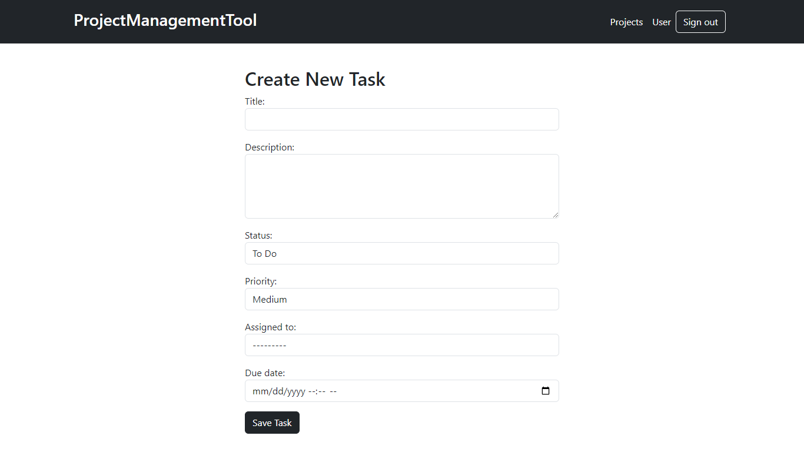
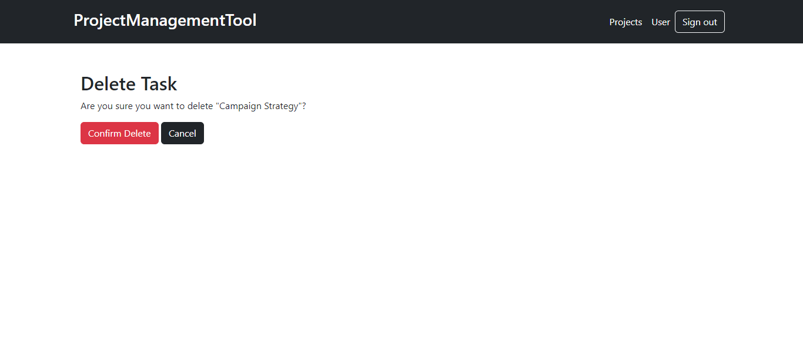

# Project Management Tool

The Project Management Tool is a collaborative project management application built using Django and SQLite. It allows users to efficiently manage projects and tasks with robust features for team collaboration and task management.

## Features

- **Project Management**: Create, update, and manage projects.
- **Task Management**: Add, assign, update, and track tasks within projects.
- **Task Assignment**: Assign tasks to team members for execution.
- **Task Progress Tracking**: Monitor task status (To Do, In Progress, Done) and priority (Low, Medium, High).
- **User Permissions**: Implement user permissions to control access to projects and tasks, ensuring confidentiality and security.
- **Profile Management**: Users can manage their profiles, including uploading profile photos.

## Technologies Used
<li>Django</li>
<li>SQlite</li>
<li>Bootstrap</li>

## Setup Instructions
1. First, you need to install Python and pip on your local machine
2. Create a folder and open the terminal in that folder
3. Create a virtual environment using the terminal. For example, the environment name is "env"
```bash
python -m venv env 
```
4. Activate the environment
```bash
env\Scripts\activate
```
5. Now you need to clone the repository.
```sh
git clone https://github.com/IftakhirNibir/Project-Management-Tool.git
```
6. Open the project folder
```sh
cd Project-Management-Tool
```
6. Install the required prerequisites
```sh
pip install -r requirement.txt
```
7. Open "ProjectManagement" folder
```sh
cd ProjectManagement
```
8. Now run the server
```sh
py manage.py runserver
```
9. Copy the link and open it in the browser
```sh
http://127.0.0.1:8000/
```

## Snapshots
### Homepage

### Signup Page

### Login Page

### User Profile

### Projects

### Create Project

### Edit project

### Task list

### Create New Task

### Task Details

### Edit Task

### Delete Task



